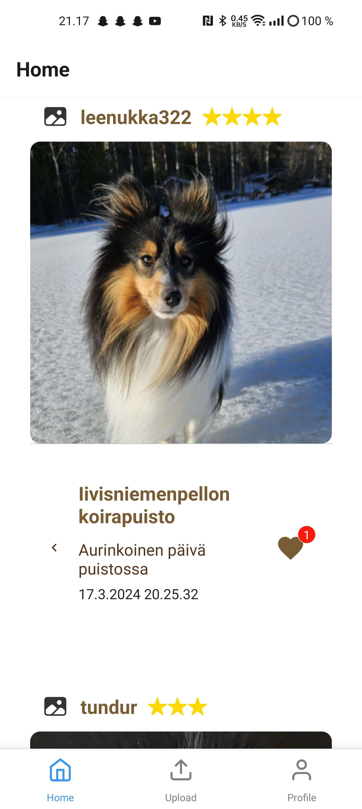
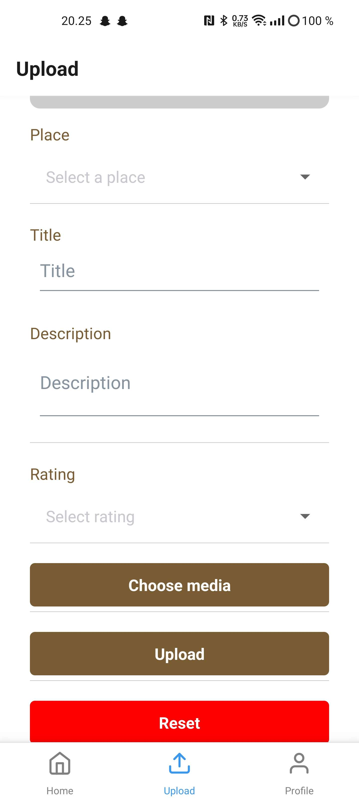
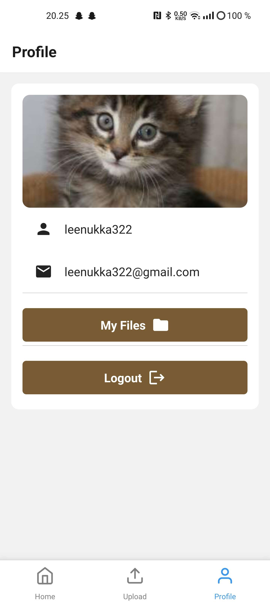
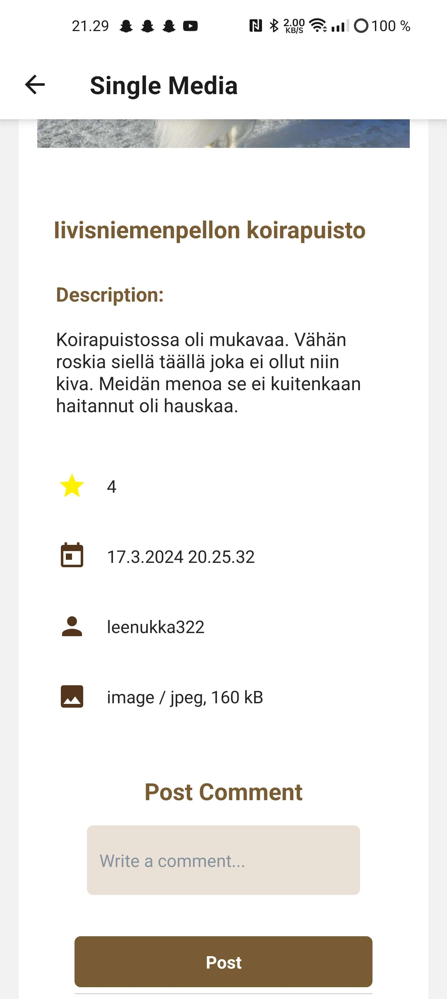
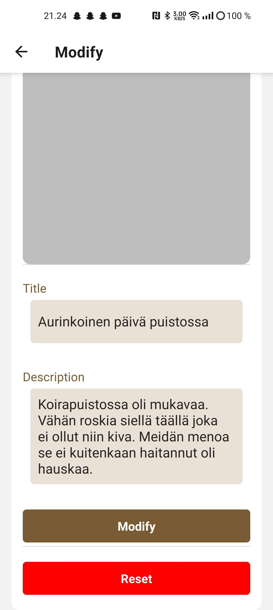
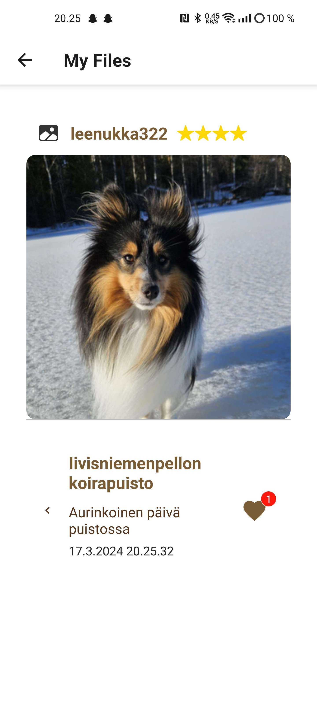

# Tassututka

## Screenshots

### Home Page

### Upload Page

### Profile Page

### Single Media Page

### Modify Page

### My Files Page

## Instructions for use
1. Install Expo CLI on your development machine by running npm install -g expo-cli.
2. Create a new React Native project using Expo by executing expo init YourProjectName.
3. Navigate into your project directory: cd YourProjectName.
4. Start your project with Expo by typing npm start. This command starts the Expo CLI server.
5. Download the Expo Go app from the App Store on your iOS or Android device.
6. Open the Expo Go app on your device and scan the QR code displayed in your terminal or in the browser window that opens automatically after starting your project. This will load your React Native application on your device through the Expo Go app.

## Database Description
This database is built for a media sharing app. It organizes information like user details, media files, and social interactions (like comments and likes).

### The Parts of the Database

#### UserLevels
This part keeps track of different roles users can have, like "admin" or "regular user". It has two main pieces of information: an ID for each role and the role's name.

#### Users
Represents the people using the app. It includes an ID, username, password, email, the ID for the user's role, and when the account was created. Usernames and emails are unique, so each one appears only once.

#### Places
This is about locations related to media files, like where a photo was taken. It has an ID for each place and the name of the place, and each place name is unique.

#### MediaItems
Keeps details about the media (like photos or videos) shared on the app. It includes an ID, the user's ID, the place's ID, file name, file size, type of media, a rating from 1 to 5, title, description, and when it was added. Media is linked to users and places through their IDs.

#### Comments
This part records comments that users make on media items. It has an ID for each comment, the media item's ID, the user's ID, the comment text, and when it was made.

#### Likes
Tracks how many likes each media item gets from users. It includes an ID for each like, the media item's ID, the user's ID, and when the like was added.

#### Tags
Manages keywords or tags that can be attached to media items to help categorize or find them. It has an ID for each tag and the tag's name, with each name being unique.

#### MediaItemTags
This is a link between media items and tags, showing which tags are attached to which media items. It uses the IDs of both media items and tags to connect them.

### Summary
This setup organizes everything the media sharing app needs, from user information to details about each media item, including who likes or comments on them, and how they are tagged. It's designed to grow with the app and supports adding more features later on.

## Functionalities

- Register and Login
- Upload reviews which includes image, parks name, title, description and the review
- Like and Comment
